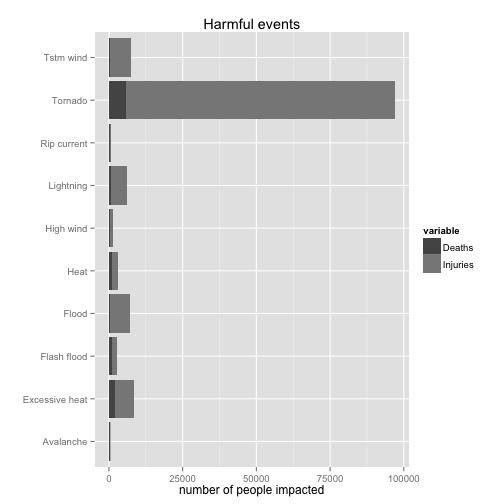
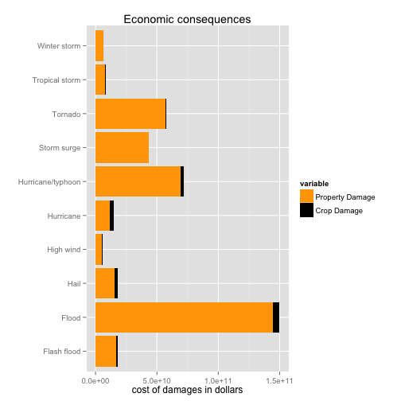

# The fatal impact of tornadoes and economic effects of floods #

## Synopsis ##

This report downloads data from NOAA Storm Database and performs a statistical analysis on the impact of physical events to population health and economy.

Examining the event types, we observe that most of the physical phenomena cause injuries to people, which sometimes are fatal. By far, Tornadoes are the most dangerous events, caused ~100.000 injuries on the last 60 years.

When analysing the event types by the impact on the economy, we observe that floods caused $15 billions damages on the last 60 years, mostly on properties.

## Data Processing ##

### Load ###

How the data were loaded into R.

Data are downloaded and imported in stormdata data frame.


```r
fileUrl <- "https://d396qusza40orc.cloudfront.net/repdata%2Fdata%2FStormData.csv.bz2"
download.file(fileUrl, destfile = "tempdata.csv.bz2", method = "curl")
stormdata <- read.csv("./tempdata.csv.bz2")
```


### Process ###

How the data are processed for analysis.

To calculate the injuries to humans, `damages` dataframe is being used, to aggregate both fatal and non-fatal injuries.

The economic impact is assessed by calculating the exponential value of the property and corp damage in data frame `economic`.

Two small data frames `dam` and `eco` are used to calculate only the top 10 events in human and economic impact respectively.


```r
library(Hmisc)
```

```
## Loading required package: grid
## Loading required package: lattice
## Loading required package: survival
## Loading required package: splines
## Loading required package: Formula
## 
## Attaching package: 'Hmisc'
## 
## The following objects are masked from 'package:base':
## 
##     format.pval, round.POSIXt, trunc.POSIXt, units
```

```r
library(reshape)
library(ggplot2)
library(car)

stormdata$EVTYPE <- capitalize(tolower(stormdata$EVTYPE))

damages <- aggregate(cbind(FATALITIES, INJURIES) ~ EVTYPE, stormdata, sum)
dam <- melt(head(damages[order(-damages$FATALITIES, -damages$INJURIES), ], 10))
```

```
## Using EVTYPE as id variables
```

```r

stormdata$PROPDMG <- stormdata$PROPDMG * as.numeric(Recode(stormdata$PROPDMGEXP, 
    "'0'=1;'1'=10;'2'=100;'3'=1000;'4'=10000;'5'=100000;'6'=1000000;'7'=10000000;'8'=100000000;'B'=1000000000;'h'=100;'H'=100;'K'=1000;'m'=1000000;'M'=1000000;'-'=0;'?'=0;'+'=0", 
    as.factor.result = FALSE))
stormdata$CROPDMG <- stormdata$CROPDMG * as.numeric(Recode(stormdata$CROPDMGEXP, 
    "'0'=1;'2'=100;'B'=1000000000;'k'=1000;'K'=1000;'m'=1000000;'M'=1000000;''=0;'?'=0", 
    as.factor.result = FALSE))

economic <- aggregate(cbind(PROPDMG, CROPDMG) ~ EVTYPE, stormdata, sum)
eco <- melt(head(economic[order(-economic$PROPDMG, -economic$CROPDMG), ], 10))
```

```
## Using EVTYPE as id variables
```


## Results ##

### Human casualties ###

* Question: Across the United States, which types of events (as indicated in the EVTYPE variable) are most harmful with respect to population health?

By using the ggplot2 library we present a combined flipped barplot graph of the fatal (Deaths) and non-fatal Injuries, by event type.


```r
ggplot(dam, aes(x = EVTYPE, y = value, fill = variable)) + geom_bar(stat = "identity") + 
    coord_flip() + ggtitle("Harmful events") + labs(x = "", y = "number of people impacted") + 
    scale_fill_manual(values = c("orange", "black"), labels = c("Deaths", "Injuries"))
```

 


### Economic impact ###

* Question: Across the United States, which types of events have the greatest economic consequences?

By using the ggplot2 library we present a combined flipped barplot graph of the property and corp damages, by event type.


```r
ggplot(eco, aes(x = EVTYPE, y = value, fill = variable)) + geom_bar(stat = "identity") + 
    coord_flip() + ggtitle("Economic consequences") + labs(x = "", y = "cost of damages in dollars") + 
    scale_fill_manual(values = c("orange", "black"), labels = c("Property Damage", 
        "Crop Damage"))
```

 

