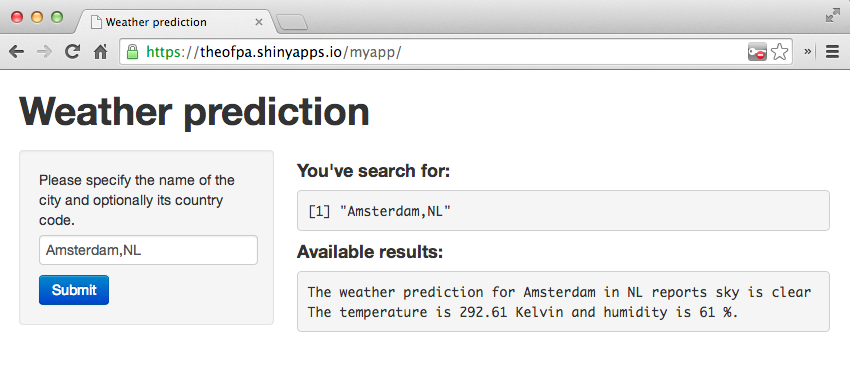

## A weather status application

By using Shiny and the OpenWeatherMap we're able to integrate a weather status project.

* [Shiny](http://shiny.rstudio.com) provides an application framework for R to create interactive web pages.
* [OpenWeatherMap](http://www.openweathermap.org) provides open API to current weather data and forecast, by using data from 40,000 weather stations around the world.

The application built during this small project is showing the weather status of a city based on the user input through a website.

--- .class #id 

## Openweather data and API

[OpenWeatherMap provides a REST API](http://www.openweathermap.org/api) to which accepts calls by city name:
```
http://api.openweathermap.org/data/2.5/weather?q=London&mode=xml
```
Returns XML which can be parsed by the XML library of R. The application loads data for a given `city` and construct the XML object:

```r
library(XML)
url = paste( "http://api.openweathermap.org/data/2.5/weather?mode=xml&q=",
             URLencode(city),sep='')
xml = xmlTreeParse(url, useInternalNodes=TRUE)
```
```{xml}
<?xml version="1.0" encoding="utf-8"?>
<current>
  <city id="2759794" name="Amsterdam"><country>NL</country></city>
  <temperature value="294.04" min="290.93" max="298.15" unit="kelvin"/>
  ...
```

--- .class #id 

## XPath evaluation

XPath query the object to extract the temperature:

```r
condition=xpathSApply(xml,"//current/clouds",xmlGetAttr,"name")
temp_c=xpathSApply(xml,"//current/temperature",xmlGetAttr,"value")
humidity=xpathSApply(xml,"//current/humidity",xmlGetAttr,"value")
country=xpathSApply(xml,"//current/city/country",xmlValue)
city=xpathSApply(xml,"//current/city",xmlGetAttr,"name")
return(cat(paste("The weather prediction for", city, "in",country,"reports", condition,
             "The temperature is", temp_c, "Kelvin and humidity is", humidity, "%.")))
```
```
The weather prediction for Amsterdam in NL reports sky is clear 
The temperature is 292.42 Kelvin and humidity is 64 %.
```

--- .class #id 

## Result
Below we observe a screenshot showing a search based on the city Amsterdam as a search keyword:

<div style='text-align: center;'>
    
</div>
